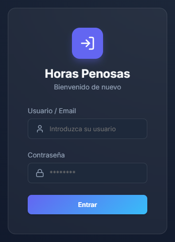
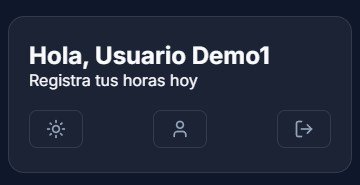
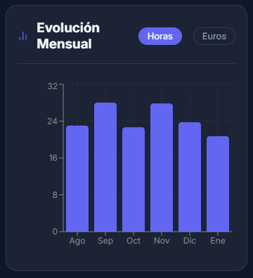
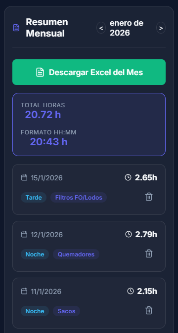
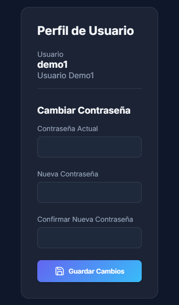

He creado esta aplicación para facilitar el registro diario de los trabajos penosos y permitir la generación automática de informes mensuales en formato Excel.

## 1. Acceso a la Aplicación

Para acceder, utiliza la URL en el móvil https://penosas.fqdev.eu (En los ordenadores corporativos, el cortafuego bloquea el dominio anterior por ser nuevo. Para los ordenadores utilizar https://qgkkwcswk4g0kgkwck08ogkw.72.62.145.230.sslip.io/)

1.	Introduce tu nombre de usuario: 
2.	Introduce tu contraseña: 
3.	Haz clic en Iniciar Sesión.

**Nota:** Se recomienda cambiar la contraseña inicial por una personal en la sección de Perfil tras el primer acceso.

________________________________________

## 2. El Panel Principal (Dashboard)

Una vez dentro, verás una interfaz dividida en tres secciones clave:

### A. Cabecera (Header)
• **Saludo Personalizado:** Verás tu nombre y un mensaje de bienvenida.
• **Modo Claro/Oscuro (Icono Sol/Luna):** Cambia la estética de la app según tu preferencia.
• **Icono Perfil:** Accede para cambiar tu contraseña.
• **Cerrar Sesión:** Sal de forma segura de tu cuenta.

### B. Evolución Mensual (Gráfico)

Un gráfico de barras que muestra tus horas registradas mes a mes. Puedes alternar la vista entre Horas totales o Euros.

### C. Nueva Entrada (Registro de Horas)

Es el formulario central para anotar tu jornada.
1. **Fecha:** Por defecto aparece el día actual.
2. **Turno:** Selecciona entre Mañana, Tarde o Noche.
3. **Tarea:** Elige la labor realizada (Sacos, Quemadores, Magnesio, etc.).
4. **Modo de Entrada:**
    - **Modo Decimal:** Ideal para entradas rápidas (ej: 1.5 que significa 1 hora y 30 minutos).
    - **Modo Horas:Min:** Permite introducir el tiempo exacto (ej: Horas: 2, Minutos: 45). El sistema se encargará de hacer la conversión decimal por ti.
5. **Guardar:** Haz clic en "Guardar Horas". Aparecerá una notificación verde confirmando que se ha registrado correctamente.

________________________________________

## 3. Consultas y Exportación

Bajo el formulario encontrarás el listado de las horas registradas en el mes actual.
• **Navegación Mensual:** Usa las flechas < y > para ver meses anteriores o futuros.
• **Totales:** Verás un banner con el total de horas del mes en formato decimal y en formato reloj (HH:MM).
• **Descargar Excel:** El botón verde "Descargar Excel del Mes" generará un archivo compatible con Excel con todo el detalle del mes seleccionado, listo para ser enviado o archivado.
• **Borrar Registros:** Si te equivocas, puedes usar el icono de la papelera en cada fila para eliminar un registro. El sistema te pedirá confirmación.

________________________________________

## 4. Perfil y Seguridad

Haciendo clic en el botón Perfil de la cabecera:
1. Introduce tu contraseña actual.
2. Introduce la nueva contraseña.
3. Guarda los cambios.
